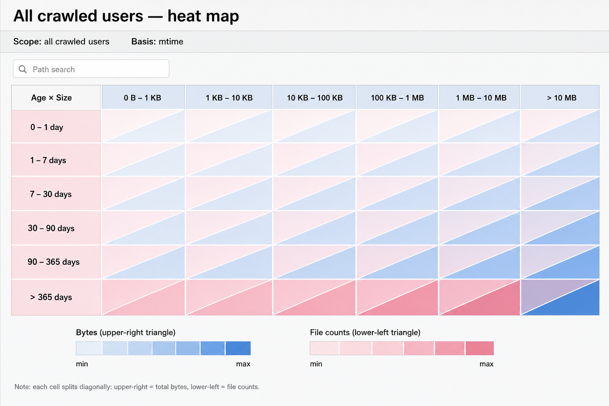
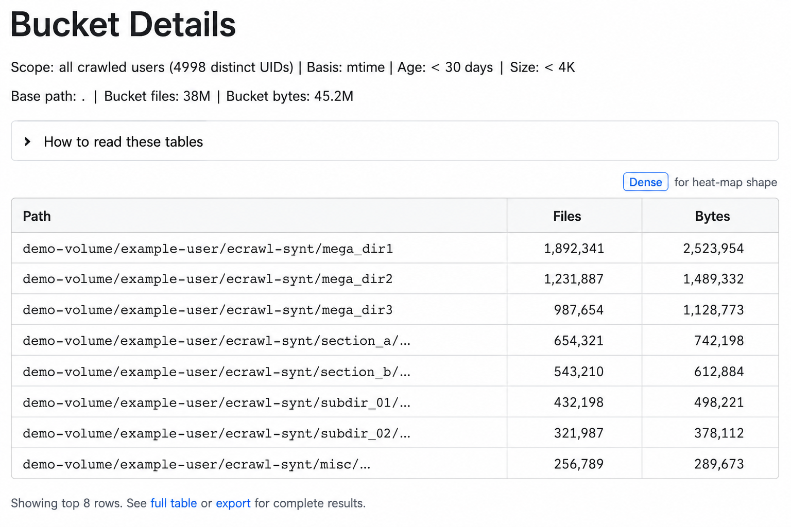

# Tool reference

Full usage, flags, examples, and per-tool behavior for every binary and `eserve.py`. For a brief overview and quick start, see the [README](../README.md). Tuning knobs are collected in [environment-variables.md](environment-variables.md); design rationale is in [performance.md](performance.md).

Contents: [`ecrawl`](#ecrawl) · [`ecrawl_repair`](#ecrawl_repair) · [`ecrawl_query`](#ecrawl_query) · [`edelete`](#edelete) · [`ereport`](#ereport) · [`ereport_index`](#ereport_index) · [`eserve.py`](#eservepy) · [Source layout](#source-layout)

## `ecrawl`

`ecrawl` walks a local filesystem tree and writes binary metadata records. It supports:

- parallel crawl threads
- uid-sharded output files
- optional `--no-write` benchmarking mode
- optional `--no-stat` names-only walk that reads no inodes, for path search
- live status output
- separate accounting for:
  - unique regular-file logical bytes (`st_size`, hardlink-deduped)
  - allocated regular-file bytes from `st_blocks` (POSIX/Linux 512-byte units, same dedup policy), plus a sparse heuristic file count when allocated < logical
  - directory apparent bytes
  - symlink apparent bytes
  - other apparent bytes

Default write-mode output, when no output directory is provided, is auto-named like:

```text
hostname_apr-17-2026_15-03-01
```

Basic usage:

```bash
./ecrawl [--no-write] [--no-stat [--count] [--contains <text>] [--print0]] [--progress] [--verbose] [--record-root <abs-path>] <start-path> [output-dir]
```

Positional arguments are only `start-path` (required) and optionally `output-dir`. `start-path` must exist; it is canonicalized with `realpath(3)` (relative or absolute). After the output directory is created, it is canonicalized the same way. If `output-dir` is omitted, a timestamped directory name is created in the current working directory.

### Directory scanning

`ecrawl` uses a flat worker pool: every non-directory name is `fstatat`’d inline on the crawl thread that read the directory. There is no cross-thread stat batching.

| Step | What happens |
|------|----------------|
| 1. `readdir` | One crawl worker reads each directory stream sequentially; skips `.` and `..`. |
| 2. Obvious subdirectories | If `d_type` is `DT_DIR`, the child path is pushed onto that worker’s directory stack (and may be donated to other crawl threads). |
| 3. Everything else | `fstatat` on the crawl thread; if it is a directory, behave like step 2; otherwise emit like a file. |

Unexpected directory: If `fstatat` reports a directory where `d_type` said otherwise (rare: wrong `d_type` or rename race), `ecrawl` counts `stat_batch_unexpected_dir_total`, prints a `WARN` block on stderr after the run (up to 100 example paths; message notes truncation), and does not descend into those paths—so totals may be incomplete if that warning appears.

Optional environment variables (no CLI flags for these; see also [environment-variables.md](environment-variables.md)):

| Variable | Meaning |
|----------|---------|
| `ECRAWL_CRAWL_THREADS` | Crawl threads (minimum 1, default 16; no fixed maximum—practical limits are RAM and OS thread capacity). |
| `ECRAWL_WRITER_THREADS` | Writer threads for uid-sharded `.bin` output (default 8). |
| `ECRAWL_WRITER_QUEUE_BATCHES` | Max pending record batches per uid-shard writer queue when writing output (default 64, range 4…4096); larger values buffer more ~1 MiB batches in RAM. Ignored with `--no-write`. |
| `ECRAWL_UID_SHARDS` | Number of uid shards; must be a power of two (default 512). |
| `ECRAWL_MAX_OPEN_SHARDS` | Per-writer shard file cache target (default 64 = every shard a writer owns at the default 512 shards / 8 writers, so many-UID workloads avoid LRU open/close churn); automatically capped against the process open-file limit. |
| `ECRAWL_DONATE_CHECK_EVERY` | During `readdir`, check whether to donate local directory-stack work every `N` `DT_DIR` pushes (default 64; `1` = check after every directory child). |
| `ECRAWL_DONATE_ENTRY_CHECK_EVERY` | During `readdir`, also check every `N` dirents (default 4096; `0` disables). The check above is driven by subdirectories found, so a deep narrow chain — one subdirectory per directory, however many files — never reaches the donation floor and walks single-threaded. This one fires on entries read instead, and when peers are idle it hands over the directories the worker is holding; the worker is mid-`readdir`, so it keeps working either way. |
| `ECRAWL_DONATE_CHUNK_FORCE_MAX` | When the local stack exceeds `ECRAWL_FORCE_DONATE_AT`, donate up to this many directories per queue push (default 2048). |
| `ECRAWL_FORCE_DONATE_AT` | Spill local directory stack to the global task queue when it holds more than this many pending dirs (default 4096). |
| `ECRAWL_DONATE_ALL_BUSY_MIN_STACK` | When every crawl thread already holds a popped task, still allow proactive donation if the local stack is at least this deep and the global queue is below `started × ECRAWL_DONATE_ALL_BUSY_MAX_QDEPTH_MULT` (default 64 dirs; range `donate_floor`…65536). |
| `ECRAWL_DONATE_ALL_BUSY_MAX_QDEPTH_MULT` | Caps global task-queue depth for that “all busy” donation path (default 4; range 1…256). |
| `ECRAWL_DISCOVERED_DIR_ENQUEUE_BATCH` | Coalesce `fstatat`-discovered subdir enqueues into fewer global queue pushes (default 48 paths per flush; range 1…4096). |
| `ECRAWL_STALL_HINT_SECONDS` | Retained for compatibility; the 1 Hz rolling-window stats thread was removed, so stall hints are not emitted. |

Examples:

```bash
./ecrawl /path/to/filesystem-tree
./ecrawl --no-write /path/to/filesystem-tree
./ecrawl --no-write --progress /path/to/filesystem-tree
./ecrawl --no-write --verbose /path/to/filesystem-tree
./ecrawl --no-stat /path/to/filesystem-tree                      # names only, no inode reads
./ecrawl --no-stat --contains slurm- /path/to/filesystem-tree    # case-insensitive path search
./ecrawl --no-stat --print0 /path/to/filesystem-tree | xargs -0 ls -l
ECRAWL_CRAWL_THREADS=8 ./ecrawl /path/to/filesystem-tree
./ecrawl /path/to/filesystem-tree host-a_apr-17-2026_15-03-01
./ecrawl --record-root /storage/srv-a /mnt/server-a crawl_srv_a
ECRAWL_UID_SHARDS=4096 ECRAWL_WRITER_THREADS=4 ./ecrawl /path/to/filesystem-tree /tmp/crawl-output
ECRAWL_MAX_OPEN_SHARDS=1024 ./ecrawl /path/to/filesystem-tree /tmp/crawl-output
ECRAWL_CRAWL_THREADS=24 ./ecrawl --no-write /path/to/filesystem-tree
```

Notes:

- `--no-write` crawls and reports metrics without writing shard files. Hardlink dedup stays on (`hardlink_dedup=on`): each regular-file inode credits `st_size` once, matching write-mode `total_bytes` and `du`/`dut` semantics.
- `--verbose` enables the full end-of-run diagnostics only; it does not imply mid-run progress.
- `--progress` prints a cheap live `files=` / `entries=` (and `bytes=` when accounted) line, driven by a per-worker dirent count that accumulates across directories (every `ECRAWL_DONATE_ENTRY_CHECK_EVERY` names, default 4096; `0` disables donation but not progress), coalesced to about two updates per second. The line goes to stderr, or to stdout with `--count` so it sits with the census. There is no dedicated progress thread. Omit it for dut-quiet timed walks.
- `--no-stat` walks names only and never reads an inode, streaming each path to stdout instead of writing a capture. It implies `--no-write` and rejects an `output-dir`, because a record needs the uid, size, inode and mtime that only `stat` provides. Recursion is driven entirely by the `d_type` that `getdents64` already returns; on a filesystem that reports `DT_UNKNOWN` the walk falls back to one `fstatat` for those entries alone and counts them in `dtype_unknown_fallbacks`. Because stdout is the path stream, the run summary goes to stderr, so `./ecrawl --no-stat /tree | sort` is a clean path list. Counts are limited to what `d_type` can prove (files, dirs, symlinks, other) — no byte totals.
- `--count` (requires `--no-stat`) only tallies those d_type counts and does not print paths. Use it for a names-only file/folder census: `./ecrawl --no-stat --count /tree`. The summary stays on stdout.
- `--contains <text>` (requires `--no-stat`) keeps only paths whose **full path** contains `text`, case-insensitively — the same rule as `ereport_index --search`, and equivalent to `find /tree | grep -iF text`. It is not a glob: `*` and `?` match themselves. Matching is cheap because a directory whose own path already matches short-circuits its whole subtree, and non-matching directories compare each child name against a small window instead of rebuilding the full path.
- `--print0` (requires `--no-stat`) NUL-separates the stream, for paths containing newlines.
- `ECRAWL_DEBUG_LOG` (megadir CSV) and `ECRAWL_PROGRESS_LOG` (1 Hz CSV) were removed; use `--progress` for live counts and `--verbose` for end-of-run metrics.
- `--record-root <path>` rewrites stored paths: each record’s path becomes `<record-root>/<path-relative-to-start-path>` instead of the live mount path. Use one distinct root per storage server so merged reports and search hits stay identifiable (for example `/storage/srv-a/...` vs `/storage/srv-b/...`). The crawl still walks `start-path` on disk; only the strings written into `.bin` files change. The root is turned into an absolute path (relative roots use the current working directory); if that path exists on disk it is also canonicalized with `realpath(3)`.

After every run (including non-verbose), stdout includes lightweight queue contention counters (relaxed atomics only; cheap to collect):

- `uid_shards`: uid shard count used for the output layout.
- `max_open_shards`: effective per-writer shard file cache after any open-file-limit auto-cap.
- `writer_failed`: `1` means at least one writer batch failed; the process exits nonzero in this case.
- `task_queue_pushes`: crawl threads pushing directory tasks onto the global task queue (donations + batched discovered subdirs).
- `queue_lock_waits` / `wait_crawl_tasks`: same underlying counter — increments once per `pthread_cond_wait` episode when a crawl thread waits on an empty global task queue (TLS-batched to the global atomics). Not “mutex acquire count” on push.
- `donate_calls`: directory-stack donation attempts (TLS-batched; folded into the global counter when threads exit).
- `writer_queue_wait_ns`: cumulative nanoseconds crawl threads spent blocked on full writer queues.
- `wait_crawl_tasks`: duplicate of the crawl-queue wait counter above (printed under both names for CSV / human readers).
- `wait_writer_push`: crawl-thread wakeups waiting on a full uid-shard writer queue (writers falling behind).
- `wait_writer_pop`: writer wakeups waiting on an empty queue (crawl threads not feeding writers fast enough).

With `--verbose`, full metrics also include `stat_batch_unexpected_dir_total`, `donate_all_busy_*`, `discovered_dir_enqueue_batch`, and crawl `manifest=` path plus `st_blocks_bytes_unit`, `total_allocated_bytes`, `files_sparse_heuristic` (same keys as `crawl_manifest.txt`).

Interpret these as counts of blocking episodes, not wall-clock time. Summary `WARN` lines for unexpected batched directories always go to stderr, even when stdout is concise.

## `ecrawl_repair`

Use `ecrawl_repair` when a crawl directory has `uid_shard_*.bin` files but `ereport` or `ereport_index --make` cannot map chunks because `.ckpt` sidecars are missing or invalid—or when you want to confirm sidecars match `crawl_bin_load_ckpt()` in `crawl_bin_chunks.c` (the shared loader used by `ereport` and `ereport_index`) before running readers.

It does not modify the `ecrawl` or `ereport` programs; it operates only on crawl output files in the directory you pass. Behavior highlights:

- Parallel shard rescans — Set `ECRAWL_REPAIR_THREADS` (default 16, minimum 1).
- Incomplete tail — If the record stream fails because the last record is truncated (common after a crashed crawl), `ecrawl_repair` `truncate`s the shard `.bin` to the last complete record boundary, rescans, and writes `*.bin.ckpt`. If `truncate` fails, the shard is treated like other corrupt files (see below).
- `*.bin.ckpt` — Written (or overwritten) next to each repaired shard using the same on-disk layout `ecrawl` uses.
- Corrupt / unusable shards — Shards that cannot be salvaged (unrecognized container header, damaged middle of the file, or truncate failure) are `rename`’d into `corrupt_shards/` under the crawl directory (optional `*.bin.ckpt` beside them moves too when possible). `ereport` only scans `uid_shard_*.bin` in the crawl directory root, so quarantined files are excluded until you move or fix them manually.
- Captures from another format version — A shard whose header carries an `ERCBIN` magic other than the current one is refused, reported by name, and left exactly where it is (not quarantined, not rewritten): the record region and the catalog tail changed independently across versions, so a header rewrite would produce a file that passes the magic check with a catalog the reader cannot parse. Re-crawl the tree; there is no conversion path.
- Summary line — After processing, stderr prints aggregate tail-truncation stats (shard count, bytes removed, original vs new totals in bytes and human-readable KiB/MiB/…) when any truncation occurred—or would-be stats with `--dry-run`.
- `--dry-run` — Does not `truncate`, `rename` to `corrupt_shards/`, or write `.ckpt`; still reports what would happen.
- `--verbose` — Per-shard progress on stdout (and `ok` on successful exit).
- Exit status — On a normal run (not `--dry-run`), exit 0 means every remaining top-level `uid_shard_*.bin` has an `ereport`-compatible sidecar; exit nonzero if operational errors occurred, verification failed, or every shard was quarantined so `ereport` would see no shard files.

Usage:

```bash
./ecrawl_repair [--dry-run] [--verbose] <crawl-output-dir>
ECRAWL_REPAIR_THREADS=32 ./ecrawl_repair /path/to/crawl-out
```

## `ecrawl_query`

`ecrawl_query` reads `uid_shard_*.bin` shards in a crawl output directory (read-only—no shard or `.ckpt` writes) and prints aggregate directory-shape metrics on stdout.

Behavior highlights:

- Chunk boundaries — Parse jobs follow `*.bin.ckpt` segment boundaries when sidecars are valid (same spirit as `ereport` / `ereport_index` chunk mapping). If a checkpoint is missing or unusable, that shard is scanned as a single range from after the file header through EOF.
- Parallelism — Worker count comes from `ECRAWL_QUERY_THREADS` (default 16, range 1…4096).
- Progress — When stderr is a TTY, a one-line status (bytes scanned, chunk and record rates, elapsed time, ETA) updates about once per second; the final report is always plain text on stdout.
- `--top N` — List the top `N` parent directories (1…100000; default 32). The default dimension is `dense` (most regular files); each row shows `nfile`, `ndir`, `nsym`, `nother`, and the parent path. Select dimensions with `--top,DIM[,DIM] N` (order-independent): `dense` = top parents by regular-file count, `deep` = deepest parent directories by path slash count. For example `--top,deep 20` lists only the deepest directories, `--top,dense,deep 20` prints both lists. The `deep` table adds a leading `depth` column.
- `--verbose` / `-v` — While scanning, prints one line per successfully parsed chunk (shard path, byte range, record count), mutex-serialized so lines are not interleaved mid-line; chunk failures are reported on stderr (often corrupt data or checkpoint mismatch).

Stdout summary (stable `key=value` / section headers) includes: shard and chunk job counts, `records_total`, distinct-parent counts, a histogram of regular files per parent (bucketed counts among parents that have at least one file), a slash-count (depth) histogram over stored paths, and the selected top lists (`top_parents_by_regular_file_count` for `dense`, `top_parents_by_depth` for `deep`).

Usage:

```bash
./ecrawl_query [--verbose] [--top[,dim...] N] <crawl-output-dir>
./ecrawl_query [--subtree DIR] [--size-gt N] [--type C] [--gid N] [--perm MODE] [--list] [--exact] [--index-dir DIR] <crawl-output-dir>
```

Examples:

```bash
./ecrawl_query /path/to/crawl-out
./ecrawl_query --top 100 /path/to/crawl-out
./ecrawl_query --top,deep 50 /path/to/crawl-out          # deepest directories only
./ecrawl_query --top,dense,deep 50 /path/to/crawl-out    # both top lists
ECRAWL_QUERY_THREADS=32 ./ecrawl_query -v /path/to/crawl-out
```

### Query form

Passing any of `--subtree` / `--size-gt` / `--type` / `--gid` / `--perm` / `--list` switches from directory-shape reporting to record selection. Filters combine with AND, and the totals come back as `key=value` lines: `entries`, `files`, `dirs`, `symlinks`, `other`, `bytes`, `hardlink_dupes`, `records_scanned`, block-skip diagnostics, `answered_from`, `elapsed_sec`. `bytes` is apparent size with each multiply-linked inode counted once, so it matches `du -sb`.

- `--subtree DIR` — records at or under `DIR`, including `DIR` itself, as `du` counts it.
- `--size-gt N` — strictly larger than `N` bytes (`find -size +Nc`).
- `--type C` — one of `f d l c b p s o` (`find -type`).
- `--gid N` — numeric group owner.
- `--perm MODE` — octal permission bits in the three `find -perm` forms: `0644` exactly these bits, `-0002` all of these bits, `/0022` any of these bits.
- `--list` — print each matching path on stdout; the totals move to stderr.
- `--exact` — never answer from the catalog rollups; always scan the records.
- `--index-dir DIR` — use the `dirs.idx` / `rowgroups.idx` sidecars an `ereport_index --make --index-dir DIR` run left there. Optional and advisory: see below.

```bash
./ecrawl_query --size-gt 524288000 --type f --list /path/to/crawl-out   # files over 500 MB
./ecrawl_query --subtree /data/lab/jones /path/to/crawl-out             # bytes + counts under a subtree
./ecrawl_query --type f --perm -0002 --list /path/to/crawl-out          # world-writable files
./ecrawl_query --type f --gid 2001 /path/to/crawl-out                   # files owned by a group
```

Two v8 storage features do the work here. Row groups whose column zone maps cannot match the `--size-gt` / `--type` / `--gid` filters are skipped without decompressing, and only the columns a query names are decoded — `ECRAWL_QUERY_BLOCK_SKIP=0` disables the skipping for comparison.

More importantly, a bare `--subtree DIR` aggregate is answered from the per-directory rollups the crawl already computed, reading no records at all (`records_scanned=0`), so its cost is O(directories) rather than O(files). That shortcut is taken only when it provably equals the scan; in particular it is skipped when any record in the subtree has `nlink > 1`, because crawl-time hardlink credit is attributed to the first link seen anywhere in the tree while a scan dedups within the subtree. `answered_from=catalog_rollup` or `answered_from=record_scan` says which ran, and `--exact` forces the scan. See [binary-format.md](binary-format.md#dfs-ordering-and-subtree-rollups-v8).

#### `--index-dir`: answering from the directory-index sidecars

Both routes above are still linear in the capture rather than the subtree. The rollup has to parse every catalog row in every shard to reach the one row holding the answer, and a filtered scan splits work on `.ckpt` boundaries, which know nothing about which directories a byte range covers. `--index-dir DIR` points `ecrawl_query` at the `dirs.idx` and `rowgroups.idx` an `ereport_index --make` run wrote there and removes both:

- A bare `--subtree` aggregate becomes a hash lookup in `dirs.idx` plus a short chain of `pread`s up the parent chain — 8 rows read where the catalog route examined 21726 directories, on the tree these were measured against. It reports `answered_from=dir_index`.
- A filtered `--subtree` scan builds its parse jobs from the row groups whose DFS sketch can reach the subtree, instead of from every checkpoint segment. On the same capture, a single mid-level directory kept 5 of 129 row groups and scanned 44129 of 1134121 records. `rowgroups_total`, `rowgroups_kept`, `rowgroups_kept_interval`, `rowgroups_kept_bitmap`, `rowgroup_bytes_total` and `rowgroup_bytes_kept` report what pruning did.

Two properties make this safe to point at an index dir you are not sure about. Every hash hit is confirmed by rebuilding the directory's path from its parent chain and comparing it byte-for-byte to the query, so a hash collision costs a wasted read rather than a wrong answer. And the sidecars are bound to the exact shards they were built from — basename, size, mtime, catalog offset, catalog entry count — so a sidecar that is absent, truncated, or describing shards that have since changed is dropped silently and the query runs as it would have without the flag. Nothing here changes an answer, only how long it takes.

The `nlink > 1` bail-out still applies: a subtree containing a hardlink falls through to the record scan whichever route located it. `--exact` continues to force the scan, and agrees with the sidecar answer.

`ereport --index-dir DIR` reads the same two files through the same reader (`crawl_sidecar.c`, linked into both binaries). It has no aggregate to look up, so it uses `dirs.idx` only to place the subtree root in each shard, and then decides membership from the record's `parent_dir_id` instead of rebuilding a path per record — see [`ereport`](#ereport) subtree scoping.

## `ecrawl_mount`

`ecrawl_mount` mounts a crawl output directory as a read-only FUSE filesystem, so any POSIX tool — `find`, `ls`, `stat`, `du`, `tree`, `df`, `fd`, `rsync -n`, shell globbing — can walk a crawl without the source filesystem being reachable. It is an optional build target: see [FUSE support](#fuse-support-optional) below.

```bash
./ecrawl_mount /path/to/crawl-out ~/mnt
find ~/mnt -mtime +365 -size +1G          # works
du -s --apparent-size ~/mnt/data/project  # exact
fusermount -u ~/mnt                       # unmount
```

### What is faithful and what is synthesized

A crawl stores metadata only, so the mounted view is metadata-only too. Everything `ecrawl` records is reported exactly:

| Reported exactly | Synthesized, because the format does not store it |
|---|---|
| `st_size`, `st_mtime`, `st_atime`, `st_ctime` | `st_mode` permission bits — `0555` for directories, `0444` otherwise |
| `st_uid`, `st_nlink`, `st_ino` | `st_gid` — `0` by default, set with `-o gid=N` |
| entry type (file, dir, symlink, device, fifo, socket) | `st_blocks` — derived as `ceil(st_size/512)` so plain `du` is not zero |
| | file contents — `read()` returns zeros up to `st_size` |
| | symlink targets — `readlink()` fails with `EIO` |

The consequences worth knowing:

- `du --apparent-size`, `wc -c`, and `dd` are byte-exact; `cat`, `grep`, and `md5sum` see a file of NUL bytes.
- Real `st_ino` and `st_nlink` mean `du` deduplicates hardlinks the same way it does on the live tree.
- `find -type l` is correct, but `ls -l` prints an I/O error for each symlink because the target was never captured.
- Permissions are uniform, so `find -perm` is meaningless **on the mount**. The capture does record real `mode` and `gid`; the mount's in-memory index omits them, because it holds the whole namespace resident and two more fields per entry is a cost paid on every mount for a read-only view that cannot honour the bits anyway. Use `ecrawl_query --perm` / `--gid` to query them from the capture directly.

### The index

The shard format is sharded by owner uid and has no path index, so one directory's children are spread across many shard files and nothing on disk maps a path to a record. `ecrawl_mount` therefore builds the whole namespace in memory at mount time, in three phases:

1. Load every shard's directory catalog and merge them into one global directory tree, interning `(parent, name)` so the same logical directory appearing in many shard catalogs collapses to one node.
2. Scan all record blocks in parallel (split on `.ckpt` boundaries, the same chunking `ereport` uses), emitting one flat row per record.
3. Bucket rows by parent directory — a counting sort whose histogram is exactly the per-directory child count — then sort each directory's children by name. `readdir` is then a contiguous slice and lookup is a binary search, with no additional index.

Cost is about 72 bytes per record plus the basenames, so roughly 90 bytes per file: ~9 GB for 100M files. Startup is dominated by zstd decompression of every shard. `--dry-run` reports the real numbers for a given crawl without mounting anything, and `--subtree PATH` mounts (and indexes) only part of the tree when the whole thing will not fit.

Measured on a 4-shard, 192k-record crawl of `/usr`: index built in 0.17 s using 18 MB.

### Paths and the mount root

Records store absolute paths, so a crawl of `/data/project` appears at `~/mnt/data/project`. Directories above the crawl root (`~/mnt/data` here) have no record of their own and are synthesized as `0555` directories owned by the mounting user, timestamped from the crawl directory. Use `--subtree /data/project` to make that directory the mount root instead, which also shrinks the index.

### Options

```
ecrawl_mount [options] <crawl-dir> <mountpoint>
ecrawl_mount -o path=<crawl-dir> [options] <mountpoint>
ecrawl_mount --dry-run [options] <crawl-dir>
```

- `-o path=DIR` — crawl directory, as an option instead of a positional argument.
- `-o subtree=PATH` / `--subtree PATH` — mount only this subtree and index only its records.
- `-o gid=N` — `st_gid` to report (default `0`).
- `-o threads=N` — index build threads (default 32, or `ECRAWL_MOUNT_THREADS`).
- `--dry-run` — build the index, print `key=value` stats on stdout, exit without mounting. Useful to validate a crawl directory or size its index: `records_total`, `directories`, `bytes_total`, `index_memory_bytes`, `elapsed_sec`, plus shard counts.
- `-f` foreground, `-d` FUSE debug, `-s` single-threaded event loop, `-v` index build progress on stderr.
- Unknown `-o` options are forwarded to libfuse, and filesystem-independent `mount(8)` flags (`ro`, `nosuid`, `relatime`, …) are accepted and ignored.

The mount is always established with `ro,use_ino,kernel_cache` and 24-hour `entry_timeout` / `attr_timeout` / `negative_timeout`, since a crawl is immutable. `-o allow_other` is accepted but needs `user_allow_other` in `/etc/fuse.conf`, which requires root to enable; without it only your own processes can see the mount.

### Using it as a mount helper

`mount -t ecrawl` needs root, because `mount(8)` dispatches `-t TYPE` to `/sbin/mount.TYPE` and the mountpoint must be writable by the caller. The argument form is already compatible, so an administrator can enable it with a symlink and no code change:

```bash
ln -s /path/to/ecrawl_mount /sbin/mount.ecrawl
mount -t ecrawl none /mnt -o path=/tmp/ecrawl-result
```

Without root, use the binary directly as shown above; it needs only the setuid `fusermount` helper that ships with the `fuse` package.

### Performance

Metadata fidelity is exact and index lookups are fast (~1.4 µs per entry served), but FUSE 2.x protocol overhead dominates directory traversal: about 130 µs fixed cost per `readdir` regardless of directory size, and ~15 µs per `getattr`. A full `find` over a 192k-entry mount takes ~5 s versus ~0.8 s on the warm live tree. FUSE 2.x cannot cache directory listings in the kernel (that arrived with FUSE 3's `cache_readdir`), so repeated traversals re-enter the filesystem each time. For bulk analytics `ereport` and `ecrawl_query` remain far faster; `ecrawl_mount` is for ad-hoc exploration with familiar tools, and for reaching a crawl whose source filesystem is gone.

### FUSE support (optional)

`ecrawl_mount` is built only when FUSE 2.x headers are found. `make` prints which way it resolved:

```
build: fuse enabled (-l:libfuse.so.2)
build: fuse not found; ecrawl_mount will not be built (try: make fuse-headers)
```

The runtime library `libfuse.so.2` is part of the base system on RHEL/Rocky (the `fuse-libs` package), but the headers live in `fuse-devel`, which needs root to install. `make fuse-headers` unpacks just the headers of the matching RPM into `$(FUSE_PREFIX)` (default `~/.local/fuse-devel`) with `curl` + `rpm2cpio` + `cpio`, no root required:

```bash
make fuse-headers && make ecrawl_mount
```

The extracted version is pinned to the distro's `libfuse.so.2` so the ABI matches; override with `FUSE_DEVEL_URL` elsewhere. If `fuse-devel` is properly installed, `pkg-config --libs fuse` is found first and the fallback is skipped. Mounting also needs `/dev/fuse` to be accessible and the setuid `fusermount` helper present.

## `edelete`

`edelete` is a parallel walker that deletes non-directory paths — everything under a path, or only entries older than an `atime`/`mtime`/`ctime` threshold. It is dry-run by default and never follows symlinks.

- Same crawl parallelism pattern as `ecrawl` — task queue, worker threads, local directory stacks, and work donation so wide trees stay busy across threads.
- Does not follow symlinks — traversal uses `lstat` / `fstatat(..., AT_SYMLINK_NOFOLLOW)`; symlink inodes can be `unlink`’d if eligible, but targets are not walked through links.
- Deletes non-directory paths only — regular files, symlinks, FIFOs, sockets, etc.; directories are opened and enumerated, then removed with `rmdir` only after `--delete` when they become empty (deepest first, without ascending above the start path or removing `/`).
- Default is dry-run — counts `would_delete` and prints `mode=dry-run`; `--delete` prints a summary of resolved path, filter, thread settings, and `verbose`, then requires typing `YES` on stdin before any `unlink` and empty-dir cleanup—unless `--force` is also passed (`--delete --force` skips the prompt for scripting). There is no separate `--dry-run` flag: omit `--delete` to preview.
- Live status line — rolling `entries/s(10s)` and totals on stdout (similar spirit to `ecrawl`); `--verbose` is currently parsed but does not change output.

Usage:

```bash
./edelete [--delete] [--force] [--verbose] [--uid <uid>] [--gid <gid>] <path>
./edelete [--delete] [--force] [--verbose] [--uid <uid>] [--gid <gid>] <atime|mtime|ctime> <days> <path>
```

Optional `--uid` and/or `--gid` restrict eligibility to entries whose `st_uid` / `st_gid` match; when both are set, both must match.

The start path is resolved to an absolute path (`realpath(3)`). With one argument, every non-directory under `path` is eligible (still dry-run unless `--delete`). With three arguments, `days` selects entries whose chosen timestamp is at least `days × 86400` seconds older than wall-clock now.

Environment variables:

| Variable | Meaning |
|----------|---------|
| `EDELETE_THREADS` | Parallel crawl workers (default 16, minimum 1). |
| `EDELETE_MAX_UNLINK_INFLIGHT` | In `--delete` mode, max concurrent `unlink(2)` calls across all threads (default 256; `0` = unlimited). |

Examples:

```bash
./edelete /tmp/staging_area
./edelete --delete /tmp/empty_me
./edelete mtime 90 /storage/scratch/job123
EDELETE_THREADS=32 ./edelete --delete ctime 14 /mnt/cache/tmp
EDELETE_MAX_UNLINK_INFLIGHT=128 ./edelete --delete atime 30 /big/tree
```

Performance tuning — unlink contention on quota'd XFS:

- On an XFS filesystem with disk quotas enabled, every `unlink(2)` must reserve and later apply quota for the file owner's dquot, all under a single per-dquot kernel mutex (`xfs_trans_dqresv` / `xfs_trans_apply_dquot_deltas`, plus `xfs_qm_dqattach` on a cold cache). When many threads delete files belonging to the **same uid/gid**, they serialize on that one mutex. In profiles this shows up as the kernel burning ~70%+ of CPU in `osq_lock` / `mutex_spin_on_owner` — i.e. spinning, not unlinking. More unlink threads then make it *slower*, not faster.
- The lever is `EDELETE_MAX_UNLINK_INFLIGHT`: lowering it caps how many threads pile onto the dquot mutex. On a quota'd XFS deleting one owner's tree, a small cap (2–4) typically matches or beats the default with a fraction of the CPU. Keep `EDELETE_THREADS` high if you like — traversal and `fstatat` parallelize fine; it is specifically concurrent `unlink` on the same dquot that serializes.
- Concurrency *does* help when deletions span many distinct owners (different dquots = different mutexes), or on filesystems without quotas (or non-XFS), where this contention is absent.
- Quick sweep to find the knee on your filesystem (compare `deleted_files` ÷ `elapsed_sec`):

```bash
for n in 1 2 4 8 16; do
  EDELETE_THREADS="$n" EDELETE_MAX_UNLINK_INFLIGHT="$n" \
    ./edelete --delete --force <path> 2>/dev/null \
    | awk -F= '/^deleted_files=/{d=$2} /^elapsed_sec=/{e=$2} END{printf "inflight=%s deleted=%s sec=%s rate=%.0f/s\n", "'"$n"'", d, e, e>0?d/e:0}'
done
```

edelete does **not** auto-detect this contention or adjust concurrency on its own; lowering `EDELETE_MAX_UNLINK_INFLIGHT` is a deliberate manual knob.

Final stdout summary includes `delete_all` (`1` when the one-argument form was used), `basis` / `age_days` when the age filter is used, `force` (`1` if `--force` was passed), `mode`, scan counts, `deleted_files`, `removed_empty_dirs`, `would_delete`, `errors`, throughput metrics, and donation counters.

## `ereport`

`ereport` reads crawl output and builds an HTML report under `./<username>/` (resolved login name), unless that name is unusable—then it falls back to `./tmp/`. If you omit the username and pass only the time basis (`./ereport atime …`), it aggregates all UIDs present in the crawl and writes under `./all_users/`. If the first token is not a time keyword and does not resolve as a login/UID, it is treated as the first `bin_dir` and the run is all-users with effective age buckets (`max(atime,mtime,ctime)` per file). For single-user runs, omitting the time argument also selects effective.

Outputs:

- `./<username>/index.html` — heat map, path search box (uses server-side index when served via `eserve`), full statistics below the table
- `./<username>/bucket_aX_sY.html` — per age/size cell; brief summary HTML unless you pass `--bucket-details N` (see below). With `--bucket-details`, each page lists directory rollup tables for N path levels below the shared prefix inside that bucket.
- `./all_users/` — same layout; `./all_users/bucket_aX_sY.html` is a brief summary unless `--bucket-details` is used (heat-map totals on `index.html` always match the crawl).

Place `--bucket-details N` (`N` = 1…32) first, before the username (if any) and time basis. Omit it for fast runs and small bucket HTML (no path reads for drill-down tables).

Search UI:

- One search field; results render below it (no sliding drawer), so it stays obvious what you're editing.
- Typing ≥3 characters shows a preview list; press Enter for paged results in the same panel. Hide collapses the panel without clearing the query.
- In-flight preview requests are aborted when the query changes, so fast typing leaves no stale matches on screen.
- Result lines show timing plus corpus scale: `indexed_paths` from the index's `meta.txt` ("~N paths indexed") when present, otherwise `index_keys` (distinct trigrams in `tri_keys.bin`, "~N trigrams").

Heat map (`index.html`):

- Each age×size cell is split diagonally: the upper-right triangle shows data volume and share of total bytes (blue intensity); the lower-left shows file count (with a rounded count like *2M* when large) and share of total files (rose intensity).
- Inner cell colors scale so the strongest inner cell reaches full saturation; row and column totals scale against the full corpus (100%) so margin labels stay comparable to "fraction of everything."
- Size-bucket (column) headers use a light blue tint; age-bucket (row) headers a light rose tint; the "Age × Size" corner and "Total" label cells stay neutral.
- The table uses `class="heatmap"` so these styles don't collide with generic `th` rules elsewhere.

Usage:

```bash
./ereport [--bucket-details N] [--subtree PATH] [--index-dir DIR] <username|uid> [<atime|mtime|ctime|effective>] [bin_dir ...]
./ereport [--bucket-details N] [--subtree PATH] [--index-dir DIR] [<atime|mtime|ctime|effective>] [bin_dir ...]   # all users → ./all_users/
```

If you omit every `bin_dir`, `ereport` reads crawl `.bin` files from the current working directory (`./`).

The first argument is treated as a time basis (`atime`, `mtime`, `ctime`, or `effective`) only when it matches exactly—otherwise it is interpreted as a username or numeric UID, or (if that fails) as the start of the `bin_dir` list for an all-users run with effective time. You cannot name an account literally `atime` without resolving that ambiguity (e.g. numeric UID).

Thread count: set `EREPORT_THREADS` (default 32). This controls parallel `.bin` chunk readers during the scan, parallel emission of `bucket_aX_sY.html` (36 heat-map cells), and the stats thread. It is not set on the command line.

Multiple crawl directories: pass several `bin_dir` paths (each an `ecrawl` output folder). Every directory must use the same layout (unsharded flat bin set vs `uid_shards`) and the same `uid_shards` count when manifests are present. For each directory, `ereport` loads that user’s shard file when you specify a user (uid-sharded layout), or every shard file when aggregating all users; unsharded layouts still load all matching bins. So twenty servers mean twenty directories and twenty shard files merged into one report (per-user), or all shards from every directory (all-users mode).

Examples:

```bash
./ereport alice atime host-b-mgmt_apr-17-2026_15-07-17
EREPORT_THREADS=16 ./ereport alice atime /tmp/crawl-out
EREPORT_THREADS=8 ./ereport 82831 mtime /tmp/crawl-out
EREPORT_THREADS=16 ./ereport alice atime crawl_srv01 crawl_srv02 crawl_srv03
./ereport alice atime crawl_a crawl_b crawl_c
./ereport atime /tmp/crawl-out
EREPORT_THREADS=16 ./ereport mtime crawl_srv01 crawl_srv02
EREPORT_THREADS=64 ./ereport ctime /path/to/crawl
./ereport --bucket-details 3 alice mtime crawl_out
./ereport --bucket-details 3 mtime crawl_srv01 crawl_srv02
./ereport alice /tmp/crawl-out                               # single-user, effective time (default)
./ereport effective /tmp/crawl-out                          # all-users, explicit effective
./ereport /tmp/crawl-out                                    # all-users effective if path is not a user name
./ereport --subtree /orcd/data/ki/001/lab/jones mtime crawl_out   # analyze only that subtree of an existing crawl
```

Parse chunks scale with input `.bin` size so parallel workers are not capped by a tiny chunk count.

Bucket drill-down:

- By default `ereport` does not read path strings: the parser seeks past path bytes and `bucket_aX_sY.html` pages stay short summaries.
- `--bucket-details N` (N = 1–32) makes it read paths and emit N directory-level rollup tables per bucket page; applies to single- and all-users runs (larger N and all-users cost more I/O and memory).
- Each level lists directories sorted by bucket bytes (largest first); past 200 directories at a depth, only the top 200 rows are written (heat-map and bucket-header totals still reflect the full bucket).
- With `--bucket-details`, pages also include a path-shape drill-down (Dense / Deep / Skew) with collapsible, sortable, slice-first sections.

Subtree scoping:

- `--subtree PATH` (absolute) restricts the whole analysis to records at or under `PATH`, as if only that directory had been crawled — useful for zooming into one lab/group inside a larger `--record-root` crawl without re-crawling. Place it before the username (if any) and time basis. The subtree directory itself is included, and matching is on a directory boundary (so `…/jones` does not match `…/jones2`).
- Full absolute paths are kept in the report (records are filtered, not rewritten); all heat-map totals, badges, distinct-user counts, and bucket-detail tables are scoped to the subtree. On its own it forces per-record path reconstruction, so it is a bit slower than the default histogram-only fast path even without `--bucket-details`.
- `--index-dir DIR` — where `ereport_index --make` left `dirs.idx` / `rowgroups.idx` (see [dir-index sidecars](#index-dir-answering-from-the-directory-index-sidecars)). Only `--subtree` uses them, and only as a shortcut to what the scan already computes: the subtree root is resolved once per shard from `dirs.idx`, row groups whose DFS sketch cannot reach it are never opened, and membership becomes a bit test on the record's `parent_dir_id` instead of a rebuilt path and a string compare — which also retires the reconstruction the histogram-only path was forced into. The report is byte-identical either way; `subtree_from=dir_index` plus `rowgroups_kept` / `rowgroups_total` / `rowgroup_records_kept` on stdout say the route was taken. A missing, stale or truncated sidecar, one that does not name every shard being read, or a `--subtree` that names something other than a directory falls back to the path-prefix behaviour with the same output. Ignored under `--path-rewrite` (the filter then runs in a namespace the catalogs know nothing about) and for `--subtree /`.
- `Scanned records` counts the whole capture either way. Pruning changes how much of it is decoded, not what the report stands for, so the records in dropped row groups are credited back; `rowgroup_records_kept` is what was actually read.
- `manifest_*` lines (e.g. `total_allocated_bytes`) come from `crawl_manifest.txt` and still describe the whole crawl, not the subtree.

Runtime behavior:

- `ereport` scans crawl directories, then maps chunk boundaries inside each `.bin` shard (reading record headers only). That mapping runs with `EREPORT_THREADS` parallel scanners; stdout shows `chunk-map files:X/Y` until every shard has been scanned, then the usual records/sec line appears while workers parse chunks. If mapping is slow, an occasional stderr advisory may print after a completed progress line so it does not glue to the `chunk-map` status text.
- After parsing finishes, the status line switches to finalizing with sub-steps: merging shard summaries (in-process merges of per-thread summaries and bucket-detail maps), writing bucket HTML (n/36) while `bucket_*.html` files are emitted, then writing index.html. Verbose mode can surface lookup substeps (repartition → path_shape scan → margins) via atomic `finalize_lookup_stage`.
- Final run stats go to stdout; warnings/errors to stderr. Progress uses local counters with chunked flushes to avoid per-record atomics on the hot path. When `crawl_manifest.txt` in the input `bin_dir` set lists `total_allocated_bytes` / `files_sparse_heuristic`, `ereport` aggregates those across merged crawls and prints `manifest_*` lines plus HTML/drilldown copy for allocated space and the sparse estimate (full-corpus crawl totals, not UID-filtered heat-map bytes).

Interactive search in `index.html` requires `ereport_index --make` (see below), `eserve` running with `ereport_index` available, and opening the report over HTTP (browser `fetch` does not work reliably from `file://`).

### Sample HTML fixtures and screenshots

The checked-in `all_users/` tree is a static report generated from a synthetic adversarial layout (with `--bucket-details`), kept in the repo so you can browse the UI without running a crawl. File paths inside those HTML files use placeholders such as `demo-volume/example-user/…` instead of real home directories, volume names, or host-specific prefixes.

- `all_users/index.html` — aggregate heat map, search box (needs HTTP + index for live search), and corpus-wide statistics for all UIDs in the crawl.
- `all_users/bucket_aX_sY.html` — Bucket details for one age×size cell: header metadata, optional Dense / Deep / Skew badges, and directory rollup tables when drill-down was enabled at generation time.

Open the HTML directly in a browser, or serve the tree with `eserve.py` / `make serve` as described below.

The images below are illustrative mockups of the layout (fonts and spacing may differ slightly from the real CSS). For pixel-accurate rendering, use the fixture files above.





## `ereport_index`

`ereport_index` builds and searches an on-disk trigram index over crawl path strings—either for one resolved Unix user or for every UID when no user is selected (see `--make` disambiguation below; same idea as `ereport` all-users mode: all uid-shard files, no UID filter on records).

Indexing is **segment-once**: trigrams are taken only from each path's basename (the final component). Parent directory names are not re-trigrammed onto every child. Directory records still contribute their own basename trigrams, and `--search` expands a matching directory to its descendants so middle-segment hits remain complete.

The search is a case-insensitive substring match on individual path segments (slashes separate segments; matches do not span `/`). For example:

```text
doc
```

matches paths such as:

```text
/path/foo/acme-docs
/path/foo/acme-docs/...
/path/foo/doc
/path/foo/doc/...
```

Queries must be at least three characters (trigram filtering).

Usage:

```bash
./ereport_index --make [--index-dir <path>] [--subtree <abs-path>] [--no-dir-index] [username|uid] [bin_dir ...]
./ereport_index --resume-merge --index-dir <path>
./ereport_index --search [--index-dir <path>] <term> [--json] [--skip N] [--limit M]
```

`--make` user vs all-users: If the first argument after optional `--index-dir` is a valid login name or numeric uid on this system, it names the report user and any further arguments are crawl directories (default `./`). If that first token is not a known user (for example it is a crawl output directory name), every argument—including the first—is treated as a `bin_dir`, and the index is built for all UIDs under `./all_users/index/` unless `--index-dir` overrides the location (same merge semantics as `ereport` aggregate output). `./ereport_index --make` with nothing after `--make` indexes `./` for all users.

`--subtree <abs-path>` (may precede or follow `--index-dir`, must come before the username/`bin_dir` arguments) indexes only records whose reconstructed full path is at or under that absolute directory, mirroring `ereport --subtree`. Full absolute paths are kept in the index, so a search over a subtree index returns the same paths as the full index would, just restricted to that directory. Matching is on a directory boundary (so `…/jones` does not match `…/jones2`).

You can pass multiple `bin_dir` paths (same merged crawl directories as for `ereport`); they are merged into one index.

`--no-dir-index` skips the directory-index sidecars. They are built by default, described under [index format](#index-format-and-on-disk-layout) below.

Examples:

```bash
./ereport_index --make alice host-b-mgmt_apr-17-2026_15-07-17
./ereport_index --make /path/to/crawl-out
./ereport_index --make crawl_srv01 crawl_srv02
./ereport_index --make --index-dir /var/lib/example-search alice crawl_a crawl_b
./ereport_index --make --subtree /orcd/data/ki/001/lab/jones /path/to/crawl-out   # index only that subtree
./ereport_index --resume-merge --index-dir /var/lib/example-search
./ereport_index --search --index-dir alice/index doc
./ereport_index --search --index-dir all_users/index doc
./ereport_index --search --index-dir /var/lib/my-index doc
./ereport_index --search --index-dir alice/index doc --json --skip 0 --limit 20   # JSON body for APIs
```

Default behavior:

- `--make [--index-dir <path>]` — without `--index-dir`, `--make <user> …` writes under `./<username>/index/` (`paths.bin`, `tri_keys.bin`, etc.). With `--index-dir`, those files go directly under `<path>` (the directory is created if needed).
- `--make` with only crawl directories (first token not a system user) writes under `./all_users/index/` unless `--index-dir` is set.
- `--make` with only `<username|uid>` and no `bin_dir` arguments reads crawl input from `./` (same idea as `ereport`).
- `--search [--index-dir <path>] <term>` — optional `--index-dir` (same flag as `--make`). If omitted, the index directory defaults to `./index` relative to the current working directory.
- `EREPORT_INDEX_THREADS` — optional; if set to an integer in 1…4096, sets parallelism for `--make` (default 32 when unset or invalid): chunk-boundary mapping runs with up to this many scanners across distinct input `.bin` files (capped by file count), and parse/index uses the same count for parallel chunk readers (parse workers). Trigram writers default to the same count; override with `EREPORT_INDEX_TRIGRAM_THREADS` (below). This does not set trigram merge worker count. Merge uses up to 16 workers by default, capped by available RAM (each merge worker may hold about 2× the largest `tmp_trigrams_*.bin` bucket in memory during sort). Tune merge parallelism with `EREPORT_INDEX_MERGE_RAM_FRAC` / `EREPORT_INDEX_MERGE_MEMORY_MB` (see below). Raising thread count increases peak RAM mostly by having more workers fill bounded queues (paths writer depth is `EREPORT_INDEX_WRITEQ_MAX_BATCHES`).
- `EREPORT_INDEX_TRIGRAM_THREADS` — optional; parallel writers appending to `tmp_trigrams_*.bin` during `--make`. Defaults to `EREPORT_INDEX_THREADS` (same integer range 1…4096). Use when trigram temp I/O is the bottleneck and you can afford more concurrent bucket files (subject to `EREPORT_INDEX_MAX_OPEN_TRIGRAM_BUCKETS` / `ulimit -n`).
- `EREPORT_INDEX_TRIGRAM_QUEUE_DEPTH` — optional; bounded queue of path jobs between the paths writer and trigram workers (range 512…262144). When unset, default depth scales with `EREPORT_INDEX_TRIGRAM_THREADS` (64× workers, minimum 4096, capped at 16384) so high parallelism does not starve workers as easily; override explicitly for more headroom (uses more RAM).
- `EREPORT_INDEX_TRIGRAM_FRAME_BYTES` — optional; source bytes accumulated per frame before it is compressed and appended to a `tmp_trigrams_*.bin` shard (default 65536, range 4096…16777216, rounded down to whole records). One frame stays buffered per *open* (worker × bucket) shard, so buffer memory is this value times `EREPORT_INDEX_MAX_OPEN_TRIGRAM_BUCKETS` times trigram workers. Raise it when merge is temp-read-bound (fewer, larger, better-compressing frames); lower it when the shard buffers themselves are the memory pressure.
- `EREPORT_INDEX_WRITE_BATCH_PATHS` — optional; target number of paths per batch handed to the paths writer (default 4096, range 512…65536). The effective flush size is also scaled down when `EREPORT_INDEX_THREADS` is high (see `write_batch_flush_at` in `--make` stats).
- `EREPORT_INDEX_WRITEQ_MAX_BATCHES` — optional override (4…4096) for how many write batches may wait on the single writer thread during `--make`. Default scales with `EREPORT_INDEX_THREADS` (about threads/3, clamped 6…96). Raising this raises peak memory if workers outpace the writer; lowering it adds backpressure (workers block until the writer drains).
- `EREPORT_INDEX_MAX_OPEN_TRIGRAM_BUCKETS` — optional cap (32…4096) on how many `tmp_trigrams_*` bucket `FILE*` handles each trigram worker may keep open (LRU); unset defaults to 4096, then split across workers using an assumed fd budget (see `ulimit` below). Lower this if you hit `EMFILE`.

### Open files (`ulimit`)

`ereport_index --make` uses many descriptors (parallel trigram shards, merge I/O, crawl inputs). Before large builds run:

```bash
ulimit -n 65535
```

(65535 or higher.) If `Too many open files` persists, raise `ulimit -n` further, lower `EREPORT_INDEX_THREADS`, or set `EREPORT_INDEX_MAX_OPEN_TRIGRAM_BUCKETS` lower. If `ulimit -n` cannot go high enough, raise the hard limit (often `/etc/security/limits.conf` or `systemd` `LimitNOFILE=`) and open a new shell.

File size (`ulimit -f`) — If `--make` dies with `File size limit exceeded` / core dump from `SIGXFSZ`, the process hit `RLIMIT_FSIZE`: the max size of any single file this process may grow (not open-file count, and not “free disk”). Use `ulimit -f unlimited` before large `--make` runs unless you deliberately cap output size.

Do not mirror `ulimit -n` onto `-f`. In bash on Linux, the number after `ulimit -f` is kilobytes (each unit is 1024 bytes). So `ulimit -f 200000` is only about 200000 × 1024 ≈ 195 MiB per file — `paths.bin` alone exceeds that quickly at ~1M paths. `ulimit -n 200000` raises the descriptor count; it does not remove a file-size cap.

Check the effective limit with `ulimit -f` / `ulimit -a` (or `prlimit`). `ereport_index` also prints a one-line stderr warning at `--make` / `--resume-merge` start when the soft limit is finite and below 64 GiB.

JSON search output is one UTF-8 JSON object per line (fields mirror `ereport_index --help`):

```json
{"total":123,"skip":0,"limit":50,"search_ms":4,"index_keys":63000,"indexed_paths":2000000,"paths":["...","..."]}
```

- `index_keys` — number of distinct trigram keys in `tri_keys.bin`.
- `indexed_paths` — corpus size from `meta.txt` (`indexed_paths=`), aligned with `paths.bin` entry count (`0` if `meta.txt` is missing or unreadable).
- `search_ms` — server-side search duration for that request.

If `--json` is given without `--limit`, limit defaults to 50.

### Index build pipeline (`--make`)

Roughly two phases:

1. Scan / index — Input `.bin` files are listed, then chunk boundaries are mapped in parallel (same idea as `ereport`, using `EREPORT_INDEX_THREADS`, capped by how many bin files exist). Parallel workers then read each chunk (record headers first). For a single-user build, rows whose UID does not match skip reading the path string (`fseek` past it). For an all-users `--make` (no resolved username as the first argument), every matched layout row’s path is indexed (no UID filter). Parsed paths are batched to a paths writer thread that appends `paths.bin` and `path_offsets.bin` in strict order, then enqueues linked trigram jobs from each write batch to the trigram queue in slices that fit current free depth (fewer mutex rounds than per-path enqueue, without stalling until an entire batch fits). Multiple trigram writer threads append `tmp_trigrams_*.bin` shard files in parallel (lazy `FILE*` handles and LRU eviction per `EREPORT_INDEX_MAX_OPEN_TRIGRAM_BUCKETS`; requires sufficient `ulimit -n`). For each path, trigram codes are sorted by bucket and written with batched `fwrite`s per bucket (fewer lock rounds and syscalls than one write per trigram). Chunk input files use large stdio buffers; trigram code lists use a cheap hybrid sort/dedup for uniqueness. The trigram job queue depth defaults to 4096 parsed paths between the paths writer and trigram workers; override with `EREPORT_INDEX_TRIGRAM_QUEUE_DEPTH` (see above).

2. Merge — Temp per-bucket trigram files are sorted and merged into `tri_keys.bin` + `tri_postings.bin`. When enough buckets have data, merge runs multiple worker threads that write per-bucket segment files, then a single thread stitches postings offsets and concatenates blobs. Reads prefer `mmap` with `malloc`+`read` fallback; sorting uses LSD radix on packed records. During indexing, the builder records which trigram buckets were touched so merge can skip `stat`-ing thousands of empty bucket paths. All heavy merge I/O uses large buffers.

At `--make` start, `ereport_index` prints one stderr line with effective parse workers, trigram workers, trigram job queue depth, and write batch path cap. Final stdout stats include `trigram_queue_depth` and `write_batch_paths` for the run.

Merge RAM cap (OOM avoidance): Parallel merge worker count is limited so that `workers × (≈2 × largest bucket file + overhead)` stays under a budget derived from `min(MemAvailable, cgroup v2 memory.max)` × `EREPORT_INDEX_MERGE_RAM_FRAC` (default 55%). Override the budget with `EREPORT_INDEX_MERGE_MEMORY_MB=<MiB>` (explicit cap) or `EREPORT_INDEX_MERGE_RAM_FRAC` (e.g. `0.6`). Session cgroups often enforce a limit far below host RAM—raising threads without raising the cgroup cap can still OOM.

#### `ereport_index.log` (memory snapshot)

During `--make` and during `--resume-merge`, a background thread appends one line every 8s to `ereport_index.log` under the index directory (`wb` = paths-writer queue bytes, `tj` = trigram job queue, `cq` = chunk-queue estimate, `mp` = estimated merge RAM peak). On resume-merge, only `mp` is meaningful (other fields stay 0).

#### `--resume-merge` (interrupted merge)

If `--make` finished the indexing phase (`paths.bin` + `path_offsets.bin` exist) but died during merge (OOM, kill, etc.), you can finish trigram output without re-scanning crawl data:

```bash
./ereport_index --resume-merge --index-dir /path/to/index
```

Resume deletes any partial `tri_keys.bin` / `tri_postings.bin`, removes orphan `merge_seg_k_*` / `merge_seg_p_*` halves left by a crash, converts remaining `tmp_trigrams_*.bin` to segment files, then stitches all segment pairs into new `tri_*` files and writes `meta.txt`.

Cannot resume when leftover `tmp_trigrams_*.bin` exist and a non-empty `tri_keys.bin` exists but there are no `merge_seg_*.bin` files (that pattern means single-thread merge was interrupted; data lived only in the partial `tri_*` stream). In that case run a full `--make` again.

`EREPORT_INDEX_THREADS` does not apply to resume-merge merge workers (same merge RAM rules as above).

### `--make` summary metrics (stdout)

Typical keys include:

- Where time goes: `chunk_prep_sec` (parallel chunk-boundary mapping only) vs `index_phase_sec` (wall clock from run start through closing `paths.bin` / `path_offsets.bin`, including scan, prep, directory setup, parallel parse + writers + draining queues) vs `merge_phase_sec` vs `wall_after_index_sec` (merge + `meta.txt` and similar; should be ≈ `merge_phase_sec` plus tiny overhead). `elapsed_sec` is end-to-end. `avg_paths_per_sec` divides by `elapsed_sec`, so it understates peak index throughput if merge is fast; use `index_paths_per_sec` (paths ÷ `index_phase_sec`) for overall index-stage rate.
- CPU by phase (Linux `getrusage`, all threads summed): on successful `--make`, lines prefixed `cpu_prep_`, `cpu_idx_`, `cpu_mrg_`, `cpu_make_` report user/sys CPU seconds, voluntary/involuntary context switches, and minor/major page faults between phase boundaries (`_cpu_user_sec`, `_cpu_sys_sec`, `_ctx_sw_vol`, etc.).
- Stdio/POSIX I/O counts for `--make`: `make_fread_*`, `make_fwrite_*`, `make_fopen_calls`, `make_fclose_calls`, `make_open_calls`, `make_read_*`, `make_mmap_calls`, `make_munmap_calls`, `make_trigram_append_batches` (once per batched append to `tmp_trigrams` for a bucket—much smaller than `trigram_records`)—useful for tuning syscalls / temp I/O behavior.
- Throughput and scale: `scanned_records`, `indexed_paths`, `trigram_records`, `unique_trigrams`, `index_workers`, `index_trigram_workers`, `writeq_max_batches`, `write_batch_flush_at` (queue backpressure and paths-per-batch flush tuning).
- Merge: `merge_phase_sec`, `merge_workers` (after RAM cap), `merge_workers_cpu` (CPU-based choice before cap), `merge_max_bucket_mib`, `merge_parallel_ram_budget_mib`, `merge_buckets_nonempty`, `merge_buckets_skipped`, `merge_trigram_records_read`, byte counts for temp reads and final `tri_*` outputs, derived `*_per_sec` rates.
- Queue wait counters (each increment only when a thread blocks on `pthread_cond_wait`; no overhead on the non-blocking fast path): `writeq_writer_waits` (paths writer starved for parse batches), `writeq_parse_waits` (parse workers blocked because the paths writer queue is full), `trigramq_paths_waits` (paths writer blocked because the trigram job queue is full), `trigramq_worker_waits` (trigram workers idle waiting for jobs). High counts usually mean raising `EREPORT_INDEX_WRITEQ_MAX_BATCHES` or `EREPORT_INDEX_TRIGRAM_QUEUE_DEPTH`, tuning `EREPORT_INDEX_THREADS` / `EREPORT_INDEX_TRIGRAM_THREADS`, or faster trigram temp I/O (subject to RAM and disk).

Successful `--resume-merge` prints a shorter set (`mode=resume_merge`, `index_dir`, `indexed_paths`, `unique_trigrams`, merge timings and sizes, `elapsed_sec`).

### Index format and on-disk layout

Current index format:

- disk-native and binary
- lowercased trigram postings for search
- original full paths stored separately for result lookup
- intended to be read directly by a later server-side helper

Current files under `<username>/index/`:

- `meta.txt` — small key/value record written at end of `--make` / `--resume-merge` (includes `indexed_paths=` corpus size and format/version fields; `trigrams=basename` on version 3+)
- `path_offsets.bin`
- `paths.bin`
- `path_isdir.bin` — bit-packed directory flags (one bit per `path_id`) for search-time descendant expansion
- `tri_keys.bin`
- `tri_postings.bin`
- `dirs.idx`, `rowgroups.idx` — the directory-index sidecars, unless `--no-dir-index` was passed

#### Directory-index sidecars (`dirs.idx`, `rowgroups.idx`)

Unlike the five files above, these two have nothing to do with trigram search. They are a lookup structure over the *shards*, written into the same directory because that is where a build already has every shard open and a place to put derived state. `ecrawl_query --index-dir DIR` reads them to answer a `--subtree` query without parsing every catalog row, and to scan only the row groups a subtree can touch; see [`ecrawl_query`](#index-dir-answering-from-the-directory-index-sidecars) and the [format reference](binary-format.md#directory-index-sidecars-dirsidx-rowgroupsidx).

They are written in a phase of their own after the trigram merge, which is why `--make` reports `dir_index_sec` separately. The phase is not allowed to fail a build: a shard it cannot summarise makes it warn, remove the partial files and leave the trigram index complete. Nothing else reads them, and no index version was bumped for them — nothing keys on the extra `meta.txt` lines, and a reader that does not find the files falls back to the catalogs.

Cost, measured on a 1.13M-record capture of 21726 directories: `dirs.idx` 509 KiB (24.0 bytes per directory, 7.1% of the capture), `rowgroups.idx` 21 KiB (169 bytes per row group, 0.3%), written in 0.013 s. `dirs.idx` scales with directory count and `rowgroups.idx` with capture size, so the ratio between them shifts with how file-dense the tree is.

`--make` reports `dir_index=1`, `dir_index_dirs`, `dir_index_bytes`, `rowgroup_index_groups`, `rowgroup_index_bytes` and `dir_index_sec` on stdout, and `meta.txt` records `dir_index`, `dir_index_dirs`, `rowgroup_index` and `rowgroup_index_groups`. Those are advisory: a reader validates the sidecars against the shards themselves, not against `meta.txt`.

#### Index version 3 (basename trigrams)

Version 3 keeps the version-2 compression layout and changes what is inverted: each path contributes trigrams from its basename only. `path_isdir.bin` is written beside `path_offsets.bin`. `--search` intersects basename postings, verifies candidates, then if any hit is a directory walks the corpus for paths under those directory prefixes so segment-anywhere semantics stay intact without re-emitting parent trigrams during `--make`.

There is no dual-read path for older indexes: `--search` and `--resume-merge` require `ereport_index_version=3` in `meta.txt`.

#### Compression (index version 2+)

The two files that dominate index size are zstd-compressed; the two that are random-accessed by fixed-size record are not.

- `paths.bin` — `EPATH002`: a 40-byte header, then the path bytes in independently compressed chunks of at most 256 KiB, then a chunk table (one row per chunk: logical start, file offset, stored and raw length). Chunks are cut on path boundaries, so a lookup decompresses exactly one chunk. The header records where the table starts, because the chunk count is only known once the last path is written. A chunk whose `stored_len` equals its `raw_len` is stored verbatim.
- `tri_postings.bin` — a posting list of at most 512 bytes stays bare delta-varints, since a frame header would cost more than the payload; anything larger is written as a sequence of independently decodable chunks of at most 128 KiB of varints, each prefixed by `[u32 raw_len][u32 stored_len][u8 is_zstd]`. Which of the two a list uses is in the previously unused `reserved` field of its `tri_keys.bin` record. Chunking rather than one frame per list keeps writer memory bounded on trigrams whose posting lists run to hundreds of MiB.
- `path_offsets.bin` — unchanged, and still offsets into the *uncompressed* path stream, so path-id arithmetic and `--resume-merge` are unaffected by any of this.
- `tri_keys.bin` — unchanged 24-byte records, binary-searched at query time; `postings_bytes` now measures the compressed span.

`EREPORT_INDEX_ZSTD_LEVEL` (default 3) sets the level for both files. The `tmp_trigrams_*.bin` scratch files, which only live for the duration of one `--make`, do not use zstd at all: they are `EITG0002` frames of delta-varints over runs of one path id with ascending trigrams, which encodes them about as small as zstd level 3 did for a fraction of the CPU.

A trained zstd dictionary for `paths.bin` was measured and rejected. A 256 KiB chunk already holds roughly 1400 neighbouring paths, so its window captures nearly all of the shared-prefix redundancy: on a 199k-path `/usr` corpus a 64 KiB dictionary shrank the compressed frames by 1.7%, but storing the dictionary made the file 3% larger overall, and training it cost 0.34 s on the paths writer — the only serial stage of the `--make` pipeline.

`--search` and `--resume-merge` also check the `EPATH002` magic in `paths.bin`, and tell you to rebuild if it is missing.

During merge, transient `tmp_trigrams_*.bin` files are removed as buckets are processed. Parallel merge may create short-lived `merge_seg_k_*` / `merge_seg_p_*` segment files under the same directory; successful runs delete them after the stitch step. `--resume-merge` also drops orphan half-segment files if a crash left only one of the pair.

## `eserve.py`

HTTP server for generated HTML/CSS and bucket pages. It also implements `GET …/search`, which runs `ereport_index --search` against the configured trigram index (default: next to the report; see Search index location below).

Requirements

- Python 3 on PATH (`python3`).
- `ereport_index` available:
  - sibling `./ereport_index` next to `eserve.py` (after `make ereport_index`), or
  - on `PATH`, or
  - override with `EREPORT_INDEX_BIN=/absolute/path/to/ereport_index`.
- Search index location (directory containing `tri_keys.bin`, etc.):
  - default: `<report>/index` next to `index.html` (or `SERVE_ROOT/<user>/index` for `GET /<user>/search`);
  - override: `--index-dir DIR` or `EREPORT_SEARCH_INDEX_DIR` (CLI wins). The same directory is used for every `…/search` request and may live outside `SERVE_ROOT`.

Make targets (from the repo root):

```bash
make serve              # bind 127.0.0.1, port 8000 by default
make serve-public       # bind 0.0.0.0 (all interfaces), same default port
```

Variables (passed to `make`):

| Variable      | Default   | Meaning                          |
|---------------|-----------|----------------------------------|
| `SERVE_ROOT`  | `.`       | Directory whose files are served (last argument to `eserve.py`) |
| `SERVE_PORT`  | `8000`    | TCP port (both `serve` and `serve-public`) |
| `SERVE_BIND`  | `127.0.0.1` | For `make serve` only: `eserve.py --bind`. `make serve-public` always uses `0.0.0.0` and does not read `SERVE_BIND`. |
| `SERVE_INDEX_DIR` | (empty) | If set, passed to `eserve.py --index-dir`. Use `SERVE_INDEX_DIR=/abs/path` (one `=`); `==/path` is a common typo—`eserve.py` strips leading `=` so absolute index paths still work. |
| `PYTHON3`     | `python3` | Python interpreter used to run `eserve.py` |

Examples:

```bash
# Serve one user’s report tree (contains index.html + index/ + bucket_*.html)
make serve-public SERVE_ROOT=./alice SERVE_PORT=8080

# Serve a parent directory that contains a user folder
make serve-public SERVE_ROOT=. SERVE_PORT=8000
# Then open http://<host>:8000/alice/index.html

# Custom port + index outside the tree (same as eserve.py --index-dir)
make serve SERVE_PORT=9000 SERVE_INDEX_DIR=/data/my_index SERVE_ROOT=./report
```

Search HTTP API (used by `index.html` via relative `fetch`):

| URL pattern | When to use |
|-------------|-------------|
| `GET /search?q=…&skip=…&limit=…` | `SERVE_ROOT` is the report directory (e.g. `./alice`) so `index.html` is at the root of the site. |
| `GET /<user>/search?q=…` | `SERVE_ROOT` contains the user folder (e.g. SERVE_ROOT=. and files live under `./alice/`). |

Parameters:

- `q` — search string (≥ 3 characters after trimming).
- `skip` — offset into the ranked match list (default `0`).
- `limit` — page size (default `50`; capped server-side).

Successful responses are `application/json` from `ereport_index`: `total`, `skip`, `limit`, `search_ms`, `index_keys`, `indexed_paths`, and `paths` (string array). Errors return JSON or plain HTTP errors depending on failure mode.

Direct `python3` invocation:

```bash
python3 eserve.py --bind 127.0.0.1 --port 8000 /path/to/serve
python3 eserve.py --bind 0.0.0.0 --port 8080 ./alice
# Index built elsewhere (single index for all /search and /<user>/search calls):
python3 eserve.py --index-dir /data/report_index /path/to/serve
```

## Source layout

- `edelete.c` — standalone parallel walker / deletion utility (`path_canon.h` only).
- `ecrawl_query.c` — read-only `uid_shard_*.bin` analyzer (parent and depth histograms, plus the record query form); links `crawl_bin_chunks.o` for shared chunk parsing.
- `crawl_bin_format.h` — magic, format version, `bin_file_header_t`, the columnar `bin_rowgroup_hdr_t` / `bin_colchunk_hdr_t`, `bin_record_hdr_t`, `bin_dir_catalog_entry_t` (immediate-child aggregates plus the v8 DFS ordering and subtree rollups).
- `crawl_bin_block.h` / `crawl_bin_block.c` — columnar row-group writer and reader: encoding choice per column, zone-map skipping, column projection, and the row-reconstruction shim.
- `crawl_bin_codec.h` / `crawl_bin_codec.c` — the per-column encoders and decoders (`RAW`, `FOR_BITPACK`, `RLE`, `CONST`); round-trip tested by `test_crawl_codec.c`.
- `crawl_bin_catalog.h` / `crawl_bin_catalog.c` — load catalog tails (`crawl_bin_catalog_load()`, path helpers).
- `crawl_bin_chunks.h` / `crawl_bin_chunks.c` — checkpoint-driven chunk boundaries (`crawl_bin_load_ckpt()`, `crawl_bin_build_chunks_for_file()`).
- `crawl_result.h` / `crawl_result.c` — open a crawl directory: parse `crawl_manifest.txt`, enumerate finalized `uid_shard_*.bin` (skipping shards still being written), validate headers. Used by `ecrawl_mount`; `ereport` and `ereport_index` still carry their own uid-filtered copies of this logic and could migrate onto it.
- `ecrawl_mount.c` — read-only FUSE view of a crawl (in-memory namespace index + libfuse 2.x high-level ops); optional target, built only when FUSE headers are present.
- `crawl_ckpt.h` — shared on-disk checkpoint layout for `uid_shard_*.bin.ckpt` sidecars; included by `ecrawl`, `ereport`, `ereport_index`, `ecrawl_repair`, and `ecrawl_query`.
- HTML emitters in `ereport.c` follow a common argument order where practical: output path / `FILE*` target first, then `username`, `all_users`, `distinct_uids`, `basis_str`, then function-specific fields (e.g. age/size bucket indices, detail levels).
